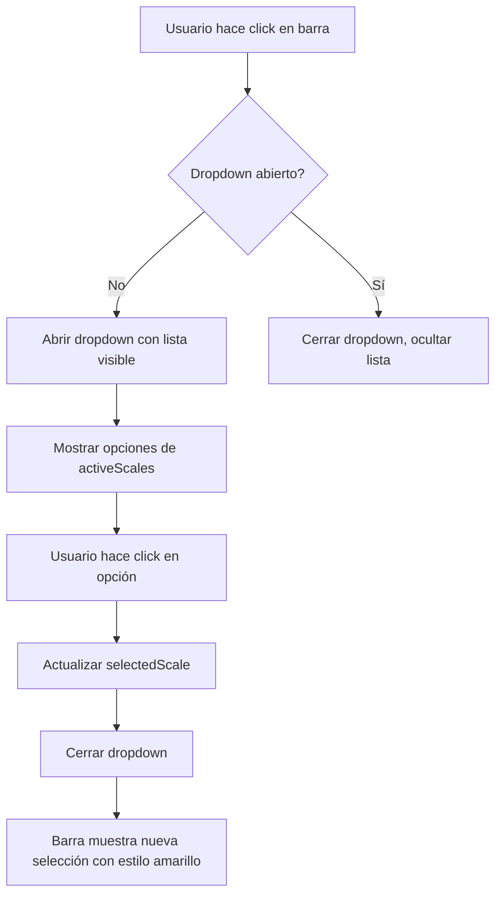

# Plan: Dropdown Custom de Escalas Disponibles

## Objetivo
Reemplazar el `<select>` nativo actual por un componente dropdown custom que permita styling completo en la escala seleccionada (fondo amarillo `#dfc47f`, texto negro `#12161c`, bordes redondeados).

---

## Estado Actual vs. Estado Deseado

| Aspecto | Actual (`<select>`) | Nuevo (Custom Dropdown) |
|---------|---------------------|-------------------------|
| **Barra principal** | Fondo oscuro `#1a1d24`, texto dorado, borde dorado semitransparente | Fondo amarillo `#dfc47f`, texto negro `#12161c`, bordes redondeados (como categoría activa) |
| **Opciones en dropdown** | Opciones nativas del navegador con hover azul | Lista de botones estilizados individualmente |
| **Escala seleccionada en lista** | No hay resaltado especial | Fondo amarillo + texto negro |
| **Hover en opciones no seleccionadas** | Hover azul nativo del navegador | Hover sutil: fondo `rgba(223, 196, 127, 0.1)` |
| **Scroll interno** | Depende del SO/navegador | Scroll después de 10 filas visibles (`max-height` + `overflow-y: auto`) |

---

## Arquitectura del Cambio

### Diagrama de Flujo



### Componente Inline: ScaleSelectorDropdown

Se implementará como un componente funcional dentro de `App.tsx` (no archivo separado), reemplazando el bloque actual en las líneas 598-614.

#### Estado Adicional Requerido

| Estado | Tipo | Propósito |
|--------|------|-----------|
| `isDropdownOpen` | `boolean` | Controlar visibilidad del dropdown (default: `false`) |

#### Props del Componente

```typescript
interface ScaleSelectorDropdownProps {
  selectedScale: ScaleName;
  scales: ScaleName[]; // activeScales de la categoría actual
  onScaleSelect: (scale: ScaleName) => void;
}
```

---

## Estructura del Dropdown Custom

```
┌─────────────────────────────────────────────┐
│ 🎹 Escalas Disponibles                       │ ← Título existente
├─────────────────────────────────────────────┤
│ Menor Armónica — T - S - T - T...    ▼     │ ← Barra principal (estilo categoría activa)
├─────────────────────────────────────────────┤
│ Frigio Dominante — S - TS - ...             │ ← Opción no seleccionada
│ Doble Armónica — S - TS - ...               │
│ Menor Húngara — T - S - TS - ...            │
│ Dórica #4 — T - S - TS - ...                │
│ Mayor Húngara — TS - S - T - ...            │
│ Hirajoshi — T - S - 2T - ...                │
│ Insen — S - 2T - T - ...                    │
│ In Japonesa — S - TS - TS - ...             │
│ Napolitana Menor — S - T - T - ...          │
│ ─────────────────────────────────────────── │ ← Scroll después de fila 10
│ Napolitana Mayor — S - T - T - ...          │
│ Persa — S - TS - S - S - ...                │ ← ESCALA ACTUAL: fondo amarillo, texto negro
│ Enigmática — S - TS - T - T - ...           │
│ Okinawan — T - S - 2T - ...                 │
│ Raga Desh Ascendente — T - TS - T - ...     │
└─────────────────────────────────────────────┘
```

---

## Cambios en `App.tsx`

### 1. Nueva State Variable (línea ~125, junto a expandedSection)

```typescript
const [isDropdownOpen, setIsDropdownOpen] = useState<boolean>(false);
```

### 2. Reemplazo del Bloque de Escalas Disponibles (líneas 598-614)

**Antes:**
```tsx
<div className="section-card">
  <h3>🎹 Escalas Disponibles</h3>
  <select value={selectedScale} onChange={...}>
    {activeScales.map((scale) => (
      <option key={scale} value={scale}>
        {getScaleBaseName(scale)} — {getScaleStepFormula(scale)}
      </option>
    ))}
  </select>
</div>
```

**Después:** Componente custom con estructura HTML + clases CSS.

### 3. Función Helper para Display Name

Reutilizar la lógica existente:
```typescript
const getScaleDisplayText = (scaleName: ScaleName): string => {
  return `${getScaleBaseName(scaleName)} — ${getScaleStepFormula(scaleName)}`;
};
```

---

## Cambios en `src/index.css`

### Nuevas Clases CSS

#### Barra Principal del Dropdown
```css
/* === Barra principal del selector de escala (estilo categoría activa) === */
.scale-selector-bar {
  display: flex;
  align-items: center;
  justify-content: space-between;
  background: #dfc47f;
  color: #12161c;
  font-weight: 600;
  border-radius: 999px;
  padding: 8px 16px;
  cursor: pointer;
  transition: all 0.2s ease;
  box-shadow: 0 2px 8px rgba(223, 196, 127, 0.3);
  font-size: 14px;
  user-select: none;
}

.scale-selector-bar:hover {
  background: #e8d5a0;
  box-shadow: 0 4px 12px rgba(223, 196, 127, 0.4);
}

.scale-selector-bar .chevron-icon {
  transition: transform 0.2s ease;
  font-size: 12px;
}

.scale-selector-bar.open .chevron-icon {
  transform: rotate(180deg);
}
```

#### Contenedor del Dropdown
```css
/* === Contenedor del dropdown de escalas === */
.scale-dropdown-container {
  position: relative;
  width: 100%;
}

/* === Lista desplegable de opciones === */
.scale-dropdown-list {
  margin-top: 8px;
  background: rgba(0, 0, 0, 0.3);
  border: 1px solid rgba(223, 196, 127, 0.2);
  border-radius: 12px;
  max-height: calc(var(--row-height) * 10); /* ~10 filas visibles */
  overflow-y: auto;
  padding: 4px;
  animation: dropdownFadeIn 0.15s ease-out;
}

/* Scrollbar personalizado para el dropdown */
.scale-dropdown-list::-webkit-scrollbar {
  width: 6px;
}

.scale-dropdown-list::-webkit-scrollbar-track {
  background: rgba(255, 255, 255, 0.03);
  border-radius: 3px;
}

.scale-dropdown-list::-webkit-scrollbar-thumb {
  background: rgba(223, 196, 127, 0.3);
  border-radius: 3px;
}

.scale-dropdown-list::-webkit-scrollbar-thumb:hover {
  background: rgba(223, 196, 127, 0.5);
}

/* === Animación de apertura del dropdown === */
@keyframes dropdownFadeIn {
  from {
    opacity: 0;
    transform: translateY(-8px);
  }
  to {
    opacity: 1;
    transform: translateY(0);
  }
}
```

#### Opciones del Dropdown
```css
/* === Opción individual de escala en el dropdown === */
.scale-dropdown-item {
  display: block;
  width: 100%;
  padding: 8px 12px;
  border-radius: 8px;
  font-size: 14px;
  text-align: left;
  cursor: pointer;
  transition: all 0.15s ease;
  white-space: nowrap;
  overflow: hidden;
  text-overflow: ellipsis;
}

/* Opción no seleccionada (inactiva) */
.scale-dropdown-item:not(.selected) {
  background: transparent;
  color: #dfc47f;
}

.scale-dropdown-item:not(.selected):hover {
  background: rgba(223, 196, 127, 0.1);
}

/* Opción seleccionada (escala activa) */
.scale-dropdown-item.selected {
  background: #dfc47f;
  color: #12161c;
  font-weight: 600;
  box-shadow: 0 2px 8px rgba(223, 196, 127, 0.3);
}

.scale-dropdown-item.selected:hover {
  background: #e8d5a0;
}
```

---

## Implementación del Componente Inline

El componente se insertará directamente en el JSX de `App.tsx`:

```tsx
{/* === Escalas Disponibles — Dropdown Custom === */}
<div className="section-card">
  <h3 className="text-base font-semibold text-[var(--color-gold)] mb-3" style={{ fontSize: '16px' }}>🎹 Escalas Disponibles</h3>
  
  <div className="scale-dropdown-container">
    {/* Barra principal */}
    <button
      type="button"
      onClick={() => {
        if (isDropdownOpen) stopPlayback();
        setIsDropdownOpen(prev => !prev);
      }}
      className={`scale-selector-bar ${isDropdownOpen ? 'open' : ''}`}
    >
      <span>{getScaleDisplayText(selectedScale)}</span>
      <span className="chevron-icon">▼</span>
    </button>

    {/* Lista desplegable */}
    {isDropdownOpen && (
      <div className="scale-dropdown-list">
        {activeScales.map((scale) => (
          <button
            key={scale}
            type="button"
            onClick={() => {
              stopPlayback();
              setSelectedScale(scale);
              setIsDropdownOpen(false);
            }}
            className={`scale-dropdown-item ${selectedScale === scale ? 'selected' : ''}`}
          >
            {getScaleDisplayText(scale)}
          </button>
        ))}
      </div>
    )}
  </div>
</div>
```

---

## Consideraciones Técnicas

### Cierre al hacer clic fuera del dropdown
Se agrega un `useEffect` que detecta clicks fuera para cerrar el dropdown:

```typescript
const dropdownRef = useRef<HTMLDivElement>(null);

useEffect(() => {
  const handleClickOutside = (event: MouseEvent) => {
    if (dropdownRef.current && !dropdownRef.current.contains(event.target as Node)) {
      setIsDropdownOpen(false);
    }
  };
  
  document.addEventListener('mousedown', handleClickOutside);
  return () => document.removeEventListener('mousedown', handleClickOutside);
}, []);
```

### Stop Playback
Al abrir el dropdown (como el `<select>` actual), se detiene cualquier reproducción activa.

### Responsividad
- El componente usa `width: 100%` para adaptarse al contenedor padre
- Las opciones con texto largo usan `text-overflow: ellipsis`
- No hay cambios en el layout grid existente

---

## Resumen de Archivos Modificados

| Archivo | Tipo de Cambio | Líneas Aproximadas |
|---------|---------------|-------------------|
| [`src/App.tsx`](src/App.tsx) | Agregar `isDropdownOpen` state, dropdownRef, useEffect click-outside, reemplazar bloque 598-614 | +30 líneas (estado), ~25 líneas reemplazadas |
| [`src/index.css`](src/index.css) | Agregar clases CSS para barra principal, lista dropdown, opciones, animación y scrollbar | +80 líneas nuevas |

**Total estimado de cambio:** ~135 líneas (añadir/modificar)

---

## Plan de Ejecución

<tool_call>
<function=update_todo_list>
<parameter=todos>
[ ] 1. Agregar clases CSS para el dropdown custom en src/index.css (barra principal, lista, opciones, animación, scrollbar)
[ ] 2. Agregar estado isDropdownOpen y ref dropdownRef en App.tsx
[ ] 3. Agregar useEffect para click-outside que cierra el dropdown
[ ] 4. Reemplazar bloque <select> (líneas 598-614) por componente custom dropdown inline
[ ] 5. Verificar que al cambiar de escala se detiene la reproducción y se cierra el dropdown
[ ] 6. Probar visualmente: fondo amarillo en barra principal, hover sutil, scroll después de 10 filas